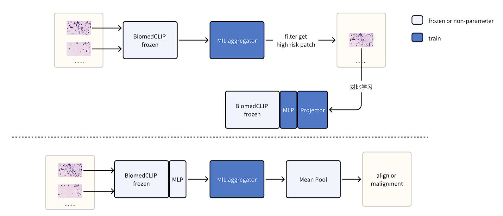

# biomed-clip-puNCE

## Requirement
```bash
conda create -n biomed python=3.8
pip install jupyter
conda install pytorch==1.12.1 torchvision==0.13.1 torchaudio==0.12.1 cudatoolkit=11.3 -c pytorch
pip install open-clip-torch transformers matplotlib
pip install h5py scikit-learn==0.22.1 future==0.18.3
pip install wandb==0.15 torchsummary==1.5.1, torchmetrics
pip install einops, chardet
```

## Train Backbone
```bash
cd simclr
```

```bash
# 训练backbone（2d 4张3080
python -m torch.distributed.launch --nproc_per_node=4 simclr_ngc.py --ddp --data_dir '/home1/wsi/ngc-2023-1333' --project=$PROJECT_NAME --model_path=$OUTPUT_PATH --title=$TITLE_NAME --seed=2023 --batch_size=64 --epochs=200 --wandb
```

## Extract WSI Features
```bash
cd extract-features
```

```bash
# 提取特征 （20min 8张2080
GPU_NUMBERS=8
FEAT_DIR='resnet_simclr_infonce_ngc_224_4x64_224_trainpart'
CKP_PATH='/root/project/biomed-clip-puNCE/simclr/output-model/resnet_simclr_infonce_ngc_224_4x64_trainpart/resnet_simclr_infonce_ngc_224_4x64_trainpart_epoch130.pt'
python -m torch.distributed.launch --nproc_per_node=$GPU_NUMBERS extract_features_ngc.py --base_model='resnet50' --output_path='result-final-ngc-features' --feat_dir=$FEAT_DIR --ckp_path=$CKP_PATH --target_patch_size 224 224 --multi_gpu
```

## MIL Train
```bash
cd mil-methods
```

```bash
# MIL整合
# abmil  （22min 单张2080
PROJECT_NAME=output-test
DATASET_PATH=/root/project/clam/result-final-ngc-features/resnet_simclr_infonce_ngc_224_4x64_224_trainpart
TITLE_NAME=resnet3-abmil-ngc-customsplit
CUDA_VISIBLE_DEVICES=0, python3 main_custome.py --project=$PROJECT_NAME --dataset_root=$DATASET_PATH --model_path=$OUTPUT_PATH --datasets=ngc --input_dim=1024 --cv_fold=1 --title=$TITLE_NAME --model=pure --baseline=attn --seed=2023 --wandb

# transmil  （38min 单张2080
PROJECT_NAME=output-test
DATASET_PATH=/root/project/clam/result-final-ngc-features/resnet_simclr_infonce_ngc_224_4x64_224_trainpart
OUTPUT_PATH=output-model
TITLE_NAME=resnet3-transmil-ngc-customsplit
CUDA_VISIBLE_DEVICES=0, python3 main_custome.py --project=$PROJECT_NAME --dataset_root=$DATASET_PATH --model_path=$OUTPUT_PATH --datasets=ngc --input_dim=1024 --cv_fold=1 --title=$TITLE_NAME --model=pure --baseline=selfattn --seed=2023 --wandb

# meanmil  （13min 单张2080
PROJECT_NAME=output-test
DATASET_PATH=/root/project/clam/result-final-ngc-features/resnet_simclr_infonce_ngc_224_4x64_224_trainpart
OUTPUT_PATH=output-model
TITLE_NAME=resnet3-meanmil-ngc-customsplit
CUDA_VISIBLE_DEVICES=0, python3 main_custome.py --project=$PROJECT_NAME --dataset_root=$DATASET_PATH --model_path=$OUTPUT_PATH --datasets=ngc --input_dim=1024 --cv_fold=1 --title=$TITLE_NAME --model=meanmil --seed=2023 --wandb

# maxmil （7min 单张2080
PROJECT_NAME=output-test
DATASET_PATH=/root/project/clam/result-final-ngc-features/resnet_simclr_infonce_ngc_224_4x64_224_trainpart
OUTPUT_PATH=output-model
TITLE_NAME=resnet3-maxmil-ngc-customsplit
CUDA_VISIBLE_DEVICES=0, python3 main_custome.py --project=$PROJECT_NAME --dataset_root=$DATASET_PATH --model_path=$OUTPUT_PATH --datasets=ngc --input_dim=1024 --cv_fold=1 --title=$TITLE_NAME --model=maxmil --seed=2023 --wandb

# MHIM(abmil)
PROJECT_NAME=output-test
DATASET_PATH=/root/project/clam/result-final-ngc-features/resnet_simclr_infonce_ngc_224_4x64_224_trainpart
OUTPUT_PATH=output-model
TITLE_NAME=resnet3-mhim(abmil)-ngc-customsplit
TEACHER_INIT=./output-model/output-test/biomedclip1-abmil-ngc-customsplit
CUDA_VISIBLE_DEVICES=1, python3 main_custome.py --project=$PROJECT_NAME --dataset_root=$DATASET_PATH --model_path=$OUTPUT_PATH --datasets=ngc --cv_fold=1 --input_dim=1024 --teacher_init=$TEACHER_INIT --title=$TITLE_NAME --baseline=attn --num_workers=0 --cl_alpha=0.1 --mask_ratio_h=0.01 --mask_ratio_hr=0.5 --mrh_sche --init_stu_type=fc --mask_ratio=0.5 --mask_ratio_l=0. --seed=2023 --wandb

# MHIM(transmil)
PROJECT_NAME=output-test
DATASET_PATH=/root/project/clam/result-final-ngc-features/resnet_simclr_infonce_ngc_224_4x64_224_trainpart
OUTPUT_PATH=output-model
TITLE_NAME=resnet3-mhim(transmil)-ngc-customsplit
TEACHER_INIT=./output-model/output-test/biomedclip1-transmil-ngc-customsplit
CUDA_VISIBLE_DEVICES=0, python3 main_custome.py --project=$PROJECT_NAME --dataset_root=$DATASET_PATH --model_path=$OUTPUT_PATH --datasets=ngc --cv_fold=1 --input_dim=1024 --teacher_init=$TEACHER_INIT --mask_ratio_h=0.03 --mask_ratio_hr=0.5 --mrh_sche --title=$TITLE_NAME --mask_ratio=0. --mask_ratio_l=0.8 --cl_alpha=0.1 --mm_sche --init_stu_type=fc --attn_layer=0 --seed=2023 --wandb

```


## 复杂流程


```bash
# 以下时间为一张或者四张3080上的运行结果
# 提取特征 30min
cd ../extract-features
GPU_NUMBERS=4
FEAT_DIR='resnet1'
WSI_ROOT='/home1/wsi/ngc-2023-1333'
python -m torch.distributed.launch --nproc_per_node=$GPU_NUMBERS extract_features_ngc.py --base_model='resnet50' --output_path='result-final-ngc-features' --feat_dir=$FEAT_DIR --wsi_root=$WSI_ROOT --target_patch_size 224 224 --multi_gpu

# 训练meanMIl 10min
cd ../mil-methods
PROJECT_NAME=output-test
DATASET_PATH='/home/huangjialong/projects/BiomedCLIP-PUNCE/extract-features/result-final-ngc-features/resnet1'
LABEL_PATH='/home/huangjialong/projects/BiomedCLIP-PUNCE/datatools/ngc_labels'
OUTPUT_PATH=output-model
TITLE_NAME=resnet1-meanmil-ngc-customsplit-tmp
CUDA_VISIBLE_DEVICES=0, python3 main_custome.py --project=$PROJECT_NAME --dataset_root=$DATASET_PATH --model_path=$OUTPUT_PATH --datasets=ngc --label_path=$LABEL_PATH --input_dim=1024 --cv_fold=1 --title=$TITLE_NAME --model=meanmil --seed=2023 --wandb

# 提取高风险patch 30min
cd ../mil-methods
FEATURE_ROOT='/home/huangjialong/projects/BiomedCLIP-PUNCE/extract-features/result-final-ngc-features/resnet1'
WSI_ROOT='/home1/wsi/ngc-2023-1333'
TRAIN_LABEL='/home/huangjialong/projects/BiomedCLIP-PUNCE/datatools/ngc_labels/ngc_train_label.csv'
CKP_PATH='//home/huangjialong/projects/BiomedCLIP-PUNCE/mil-methods/output-model/output-test/resnet1-meanmil-ngc-customsplit-tmp/fold_0_model_best_auc.pt'
OUTPUT_ROOT='/home1/wsi/output-filter/ngc-meanmil'
python inference-multi.py --feature_root=$FEATURE_ROOT --wsi_root=$WSI_ROOT --output_root=$OUTPUT_ROOT --train_label=$TRAIN_LABEL --ckp_path=$CKP_PATH   --model=meanmil

====================================================================

# 训练backbone（4h    4张3080
cd ../simclr
PROJECT_NAME='simclr-puc'
OUTPUT_PATH='output-model'
DATA_DIR='/home1/wsi/output-filter/ngc-meanmil'
TITLE_NAME='resnet_simclr_infonce_filter-ngc_224_4*256_224'
python -m torch.distributed.launch --nproc_per_node=4 simclr_ngc.py --ddp --data_dir=$DATA_DIR --project=$PROJECT_NAME --model_path=$OUTPUT_PATH --title=$TITLE_NAME --seed=2023 --batch_size=256 --epochs=200 --wandb


# 提取特征 （20min 4张3080
cd ../extract-features
GPU_NUMBERS=4
FEAT_DIR='resnet4'
WSI_ROOT='/home1/wsi/ngc-2023-1333'
CKP_PATH='/home/huangjialong/projects/BiomedCLIP-PUNCE/simclr/output-model/simclr-puc/resnet_simclr_infonce_filter-ngc_224_4*256_224/resnet_simclr_infonce_filter-ngc_224_4*256_224_epoch200.pt'
python -m torch.distributed.launch --nproc_per_node=$GPU_NUMBERS extract_features_ngc.py --base_model='resnet50' --output_path='result-final-ngc-features' --feat_dir=$FEAT_DIR --wsi_root=$WSI_ROOT --ckp_path=$CKP_PATH --target_patch_size 224 224 --multi_gpu

# MIL整合
# meanmil  （13min 单张2080
cd ../mil-methods
OUTPUT_PATH='output-model'
DATASET_PATH='/home/huangjialong/projects/BiomedCLIP-PUNCE/extract-features/result-final-ngc-features/resnet4'
LABEL_PATH='/home/huangjialong/projects/BiomedCLIP-PUNCE/datatools/ngc_labels'
PROJECT_NAME=output-test
TITLE_NAME=resnet4-meanmil-ngc-customsplit
CUDA_VISIBLE_DEVICES=0, python3 main_custome.py --project=$PROJECT_NAME --dataset_root=$DATASET_PATH --model_path=$OUTPUT_PATH --datasets=ngc --label_path=$LABEL_PATH --input_dim=1024 --cv_fold=1 --title=$TITLE_NAME --model=meanmil --seed=2023 --wandb

# maxmil （7min 单张2080
cd ../mil-methods
OUTPUT_PATH='output-model'
DATASET_PATH='/home/huangjialong/projects/BiomedCLIP-PUNCE/extract-features/result-final-ngc-features/resnet4'
LABEL_PATH='/home/huangjialong/projects/BiomedCLIP-PUNCE/datatools/ngc_labels'
PROJECT_NAME=output-test
TITLE_NAME=resnet4-maxmil-ngc-customsplit
CUDA_VISIBLE_DEVICES=0, python3 main_custome.py --project=$PROJECT_NAME --dataset_root=$DATASET_PATH --model_path=$OUTPUT_PATH --datasets=ngc --label_path=$LABEL_PATH --input_dim=1024 --cv_fold=1 --title=$TITLE_NAME --model=maxmil --seed=2023 --wandb

# abmil  （22min 单张2080
cd ../mil-methods
OUTPUT_PATH='output-model'
DATASET_PATH='/home/huangjialong/projects/BiomedCLIP-PUNCE/extract-features/result-final-ngc-features/resnet4'
LABEL_PATH='/home/huangjialong/projects/BiomedCLIP-PUNCE/datatools/ngc_labels'
PROJECT_NAME=output-test
TITLE_NAME=resnet4-abmil-ngc-customsplit
CUDA_VISIBLE_DEVICES=0, python3 main_custome.py --project=$PROJECT_NAME --dataset_root=$DATASET_PATH --model_path=$OUTPUT_PATH --datasets=ngc --label_path=$LABEL_PATH --input_dim=1024 --cv_fold=1 --title=$TITLE_NAME --model=pure --baseline=attn --seed=2023 --wandb

# transmil  （38min 单张2080
cd ../mil-methods
OUTPUT_PATH='output-model'
DATASET_PATH='/home/huangjialong/projects/BiomedCLIP-PUNCE/extract-features/result-final-ngc-features/resnet4'
LABEL_PATH='/home/huangjialong/projects/BiomedCLIP-PUNCE/datatools/ngc_labels'
PROJECT_NAME=output-test
TITLE_NAME=resnet4-transmil-ngc-customsplit
CUDA_VISIBLE_DEVICES=0, python3 main_custome.py --project=$PROJECT_NAME --dataset_root=$DATASET_PATH --model_path=$OUTPUT_PATH --datasets=ngc --label_path=$LABEL_PATH --input_dim=1024 --cv_fold=1 --title=$TITLE_NAME --model=pure --baseline=selfattn --seed=2023 --wandb

# MHIM(abmil)
PROJECT_NAME=output-test
DATASET_PATH=/home/huangjialong/projects/BiomedCLIP-PUNCE/extract-features/result-final-ngc-features/resnet4
OUTPUT_PATH=output-model
TITLE_NAME=resnet3-mhim(abmil)-ngc-customsplit
TEACHER_INIT=./output-model/output-test/biomedclip1-abmil-ngc-customsplit
CUDA_VISIBLE_DEVICES=1, python3 main_custome.py --project=$PROJECT_NAME --dataset_root=$DATASET_PATH --model_path=$OUTPUT_PATH --datasets=ngc --cv_fold=1 --input_dim=1024 --teacher_init=$TEACHER_INIT --title=$TITLE_NAME --baseline=attn --num_workers=0 --cl_alpha=0.1 --mask_ratio_h=0.01 --mask_ratio_hr=0.5 --mrh_sche --init_stu_type=fc --mask_ratio=0.5 --mask_ratio_l=0. --seed=2023 --wandb

# MHIM(transmil)
PROJECT_NAME=output-test
DATASET_PATH=/root/project/clam/resnet4
OUTPUT_PATH=output-model
TITLE_NAME=resnet4-mhim(transmil)-ngc-customsplit
TEACHER_INIT=./output-model/output-test/biomedclip1-transmil-ngc-customsplit
CUDA_VISIBLE_DEVICES=0, python3 main_custome.py --project=$PROJECT_NAME --dataset_root=$DATASET_PATH --model_path=$OUTPUT_PATH --datasets=ngc --cv_fold=1 --input_dim=1024 --teacher_init=$TEACHER_INIT --mask_ratio_h=0.03 --mask_ratio_hr=0.5 --mrh_sche --title=$TITLE_NAME --mask_ratio=0. --mask_ratio_l=0.8 --cl_alpha=0.1 --mm_sche --init_stu_type=fc --attn_layer=0 --seed=2023 --wandb


```
