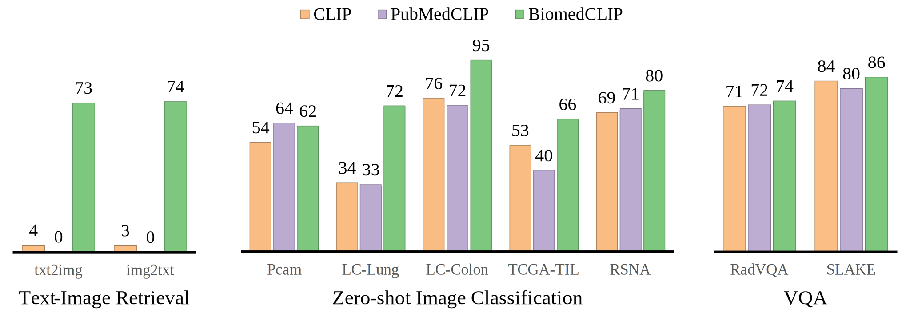

# BiomedCLIP-PubMedBERT_256-vit_base_patch16_224

[BiomedCLIP](https://aka.ms/biomedclip-paper) is a biomedical vision-language foundation model that is pretrained on [PMC-15M](https://aka.ms/biomedclip-paper), a dataset of 15 million figure-caption pairs extracted from biomedical research articles in PubMed Central, using contrastive learning. 
It uses PubMedBERT as the text encoder and Vision Transformer as the image encoder, with domain-specific adaptations.
It can perform various vision-language processing (VLP) tasks such as cross-modal retrieval, image classification, and visual question answering. 
BiomedCLIP establishes new state of the art in a wide range of standard datasets, and substantially outperforms prior VLP approaches:




## Citation

```bibtex
@misc{https://doi.org/10.48550/arXiv.2303.00915,
  doi = {10.48550/ARXIV.2303.00915},
  url = {https://arxiv.org/abs/2303.00915},
  author = {Zhang, Sheng and Xu, Yanbo and Usuyama, Naoto and Bagga, Jaspreet and Tinn, Robert and Preston, Sam and Rao, Rajesh and Wei, Mu and Valluri, Naveen and Wong, Cliff and Lungren, Matthew and Naumann, Tristan and Poon, Hoifung},
  title = {Large-Scale Domain-Specific Pretraining for Biomedical Vision-Language Processing},
  publisher = {arXiv},
  year = {2023},
}
```

## Model Use

### How to use

Please refer to this [example notebook](https://aka.ms/biomedclip-example-notebook).

### Intended Use

This model is intended to be used solely for (I) future research on visual-language processing and (II) reproducibility of the experimental results reported in the reference paper.

#### Primary Intended Use

The primary intended use is to support AI researchers building on top of this work. BiomedCLIP and its associated models should be helpful for exploring various biomedical VLP research questions, especially in the radiology domain.

#### Out-of-Scope Use

**Any** deployed use case of the model --- commercial or otherwise --- is currently out of scope. Although we evaluated the models using a broad set of publicly-available research benchmarks, the models and evaluations are not intended for deployed use cases. Please refer to [the associated paper](https://aka.ms/biomedclip-paper) for more details.

## Data

This model builds upon [PMC-15M dataset](https://aka.ms/biomedclip-paper), which is a large-scale parallel image-text dataset for biomedical vision-language processing. It contains 15 million figure-caption pairs extracted from biomedical research articles in PubMed Central. It covers a diverse range of biomedical image types, such as microscopy, radiography, histology, and more.

## Limitations

This model was developed using English corpora, and thus can be considered English-only.

## Further information

Please refer to the corresponding paper, ["Large-Scale Domain-Specific Pretraining for Biomedical Vision-Language Processing"](https://aka.ms/biomedclip-paper) for additional details on the model training and evaluation.